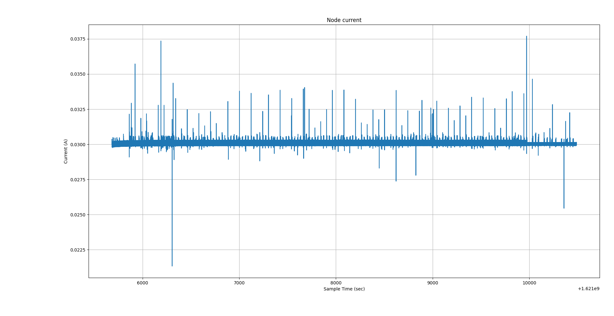
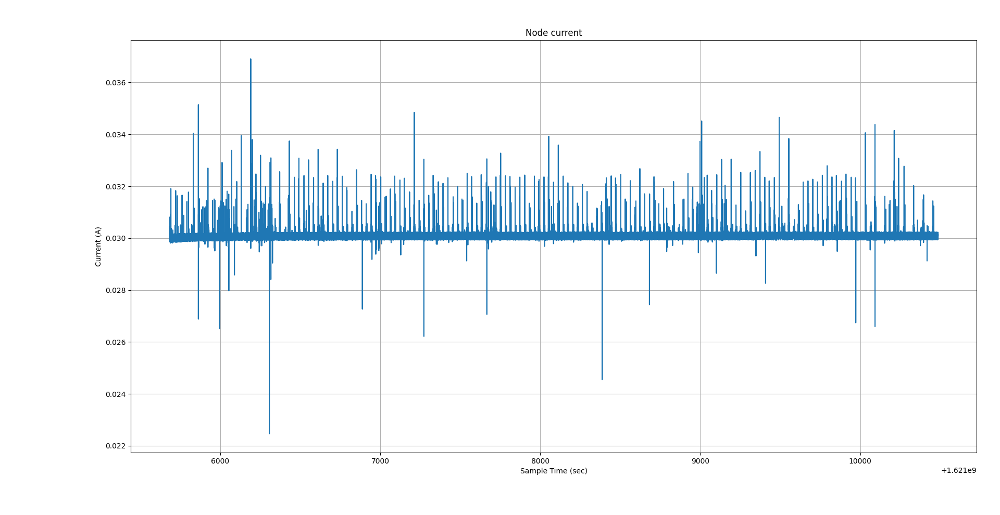
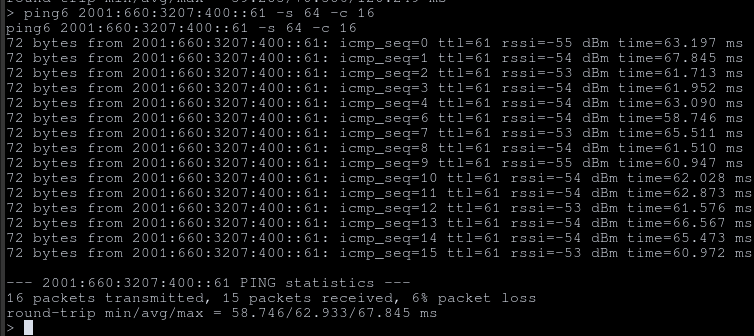

## Performance evaluation
### Current consumption

In this graph is represented the current consumption, there are periodically peaks (the smaller peaks) that are generated by the radio interface when a packet is transmitted. this graph represents only the current consumption of the nucleo board without sensors, so the energy consumption of the entire project will be larger.

This graph represents the current consumption of the border router, routing the traffic of all the networks nodes, it has a larger power consumption. The wireless components are one of the most energy expensive components inside the project, so if we use it a lot of times, the power consumption increases.

### Network evaluation

The nodes are connected via 6LoWPAN using the standard IEEE 802.15.4, they are IoT-LAB M3 boards which include a radio chip [AT86RF231](https://iot-lab.github.io/assets/misc/docs/iot-lab-m3/AT86RF231.pdf) by Atmel.
The frequency band is 2.4 Ghz and the maximum bandwidth is 256 kbit/s.
The range is very short, 40/50 meters indoors.

The nodes use the channel 17, the RSSI, the relative received signal strength, is about  -55 dBm for all experiment nodes.
Sometimes, maybe because there are another devices on the same channel from other experiments, is very hard to connect the nodes between them, the border router is not reachable by the application nodes.

#### Latency

Using the ping command the latency of the round-trip to the broker is between 60ms and 67ms (min and max of 8 tests) with 1 packet lost of 16 packets sent.

Using the ping command on multiple devices at the same time, some packets are loss.

For example, using the serial aggregator provided by IoT-LAB to ping 5 node to the broker, i've got these results.

| Node       | Node 1 | Node 2 | Node 3 | Node 4 | Node 5 |
| ---------- | ------ | ------ | ------ | ------ | ------ |
| 5 nodes    | 0 %    | 0 %    | 0 %    | 66 %   | 66 %   |
| 4 nodes    | -      | 0 %    | 0 %    | 0 %    | 100 %  |
| 3 nodes    | -      | -      | 0 %    | 0 %    | 100 %  |
| 2 nodes    | -      | -      | -      | 66 %   | 66 %   |
| 1 node (A) | -      | -      | -      | 100%   | -      |
| 1 node (B) | -      | -      | -      | -      | 100%   |

The best scenario is when 2 nodes ping successfully the broker with 66% of the packages delivered, during multiple experiment, using different nodes and channels, the best scenario that i have got was with 4 nodes connected together, but it is very variable, it depends on the other experiments that are run simultaneity in the deployment location.

From this table we can see that with one node, 100 % of the packets are delivered, but with multiple node, at most 66 % of the packets on 2 nodes are sent successfully.
