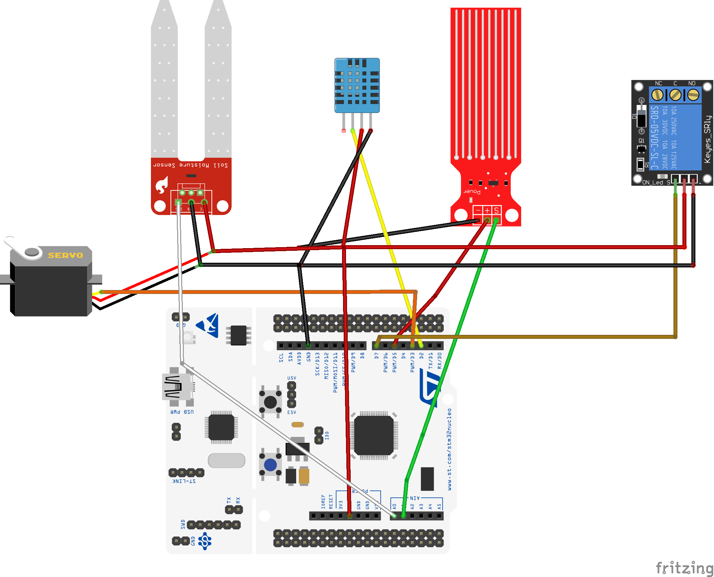
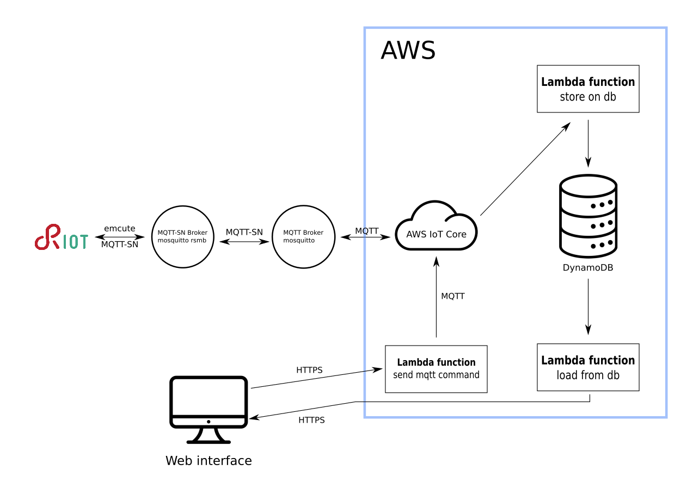

# Greenhouse powered by RIOT OS

This project is an IoT Greenhouse based on nucleo-f401re and RIOT OS, the greenhouse is fully
autonomous, it opens a windows when the indoor environment humidity is too high, and there is
a pump that water the soil when it is dry, the pump get the water from a tank provided with a level sensor, 
in such a way that if the tank is dry, the pump isn't turn on to avoid to damage it.

The greenhouse can be monitored by the [web interface](https://kernel-machine.github.io/RIOT-GreenHouse/)

The advantages of having an IoT greenhouse are:
- The plants are always in a ideal environment, with the right soil moisture and air humidity
- The plants are watered even if the user are not present and the user can controls remotely that the plants are fine
- If well tuned it can increase the productivity.
- If well tuned it can save water, watering only if needed with the optimal quantity

## Sensors and actuators used
The sensor used are:
- DHT11, a digital sensor used to measure air temperature and humidity.
- SOIL MOISTURE sensor, an analog sensor used to measure the soil moisture
- WATER LEVEL sensor, an analog sensor used to measure the water level inside the tank

Tha actuators are:
- RELAY, used to toggle a 230V pump
- SERVO MOTOR, used to open or close a windows on the greenhouse

All sensor sensor are periodically fetched, with the interval setted in `Makefile.conf.include`.

### Actions
The SERVO MOTOR the open the window is activated by this rule:

`IF DHT11.Humidiy > MAX_HUMIDITY THEN setServo(180) ELSE setServo(0)`

So when the air humidity is greater that a fixed threshold the servo rotate of 180° opening the window, 
otherwise the window is closed (0°).

While for the RELAY the power the pump:

`IF soil moisture < MIN_MOISTURE && water level > 20% THEN turn on ELSE turn off`

The relay is turned on only if the soil is dry and there is enough water in the tank.

The relay is turned on for a specific number of seconds in such a way to pump the right
quantity of water for the jar size, the number of seconds depends by the pump capacity.

Action is checked every `PUMP_INTERVAL` minutes in order to allow the water to penetrate in to the 
terrain to have a correct soil moisture read.

## Collected data

Each sensor report these data:
#### DHT11
- **Sensor type** digital
- **Temperature**
    - **Unit** Celsius degree °C
    - **Range** 0-50 °C
    - **Accuracy** at most ±2°C
- **Humidity**
    - **Unit** Relative Humidity %RH
    - **Range** 
        - 30 - 90 %RH at 0°C
        - 20 - 90 %RH at 25°C
    - **Accuracy** ±4 %RH at 25° C
- **Default fetch interval** 20s
    
#### Water level sensor
- **Sensor type** analog
- **Range**
    - 0V fully dry
    - VCC fully immersed 
- **Default fetch interval** 20s
    
#### Soil moisture
- **Sensor type** analog
- **Range**
    - 0V fully dry
    - VCC sensor in water
- **Default fetch interval** 20s
    
For analog sensors the fetched data is the tension read by the ADCs, it's converted in to
percentage by software.
       
Water level, Temperature, Humidity and Soil moisture are published on MQTT-SN broker. 

It is possible to tune parameters and scan interval editing the values in `Makefile.conf.include`

All sensor are fetched with a specific interval and the actions are executed with a different timing
with the last value fetched.

The action that open/close the windows is checked every sensors fetch, while the action that toggle the pump
is checked every 30 minutes (by default).

## Web Interface
With the web interface is possible to visualize the last hour of received data in charts,
it show aggregated and current values for the sensors and it's possible to toggle the pump and open and 
close the window.

## Connections
The sensors must be connected according this picture.

The water level sensor power pin is connected to the pin D5 to power on it only during a
measurement to avoid oxidations.

If you prefer to change your pin connection, you can change editing in the file `src/gh_init.c` this values
```C
...
#define DHT_PIN                 GPIO_PIN(PORT_A, 10)    //D2
#define WATER_LEVEL_ADC         ADC_LINE(1)             //A0
#define SOIL_MOISTURE_ADC       ADC_LINE(2)             //A1
#define RELAY_PIN               GPIO_PIN(PORT_A, 8)     //D7
#define WATER_LEVEL_POWER_PIN   GPIO_PIN(PORT_B, 4)     //D5
#define SERVO_CHANNEL           1
#define SERVO_PWM               0
...
```

## Software component on IoT device
Some libraries was implemented to have a clean, understandable a reusable code.

- Devices are processed with the library DeviceManager (`devices/devices_manager.h`), in order to have an unique interface 
to access to sensors data.
- Logic condition to check if an action should be executed are implemented with another library (`src/logic_condition.h`)
that provide a reusable function to get this actions.
- There is a scheduler that call the functions with a specific time (`src/gh_scheduler.h`) 
- There also another library for networks commands.

In the file `gh_init.c` there is all the invocation to the functions that setup the code:

Initialize all sensors 
```C
void gh_init(void) {
    xtimer_init();

    dht11_init(&dht, DHT_PIN);

    analog_device_init(&water_level, WATER_LEVEL_ADC);
    analog_device_init(&soil_moisture, SOIL_MOISTURE_ADC);

    digital_out_init(&pump, RELAY_PIN);
    digital_out_init(&water_level_power, WATER_LEVEL_POWER_PIN);
    servo_device_init(&servo, SERVO_PWM, SERVO_CHANNEL);
```
Associate a label to a sensor
```C
    device_manager_add(TEMP_HUM, &dht);
    device_manager_add(WATER_LEVEL, &water_level);
    device_manager_add(WATER_LEVEL_POWER, &water_level_power);
    device_manager_add(SOIL_MOISTURE, &soil_moisture);
    device_manager_add(PUMP, &pump);
    device_manager_add(SERVO, &servo);
```
Set the interval between a fetch and another of the sensor, for the actuator the interval
represents how ofter the actuators can be updated, if set to 0, reading and control are in "real time"
```C
    device_manager_set_scan_interval(TEMP_HUM, S2MS(DHT_INTERVAL));
    device_manager_set_scan_interval(WATER_LEVEL, S2MS(WATER_LEVEL_INTERVAL));
    device_manager_set_scan_interval(SOIL_MOISTURE, S2MS(SOIL_INTERVAL));
    device_manager_set_scan_interval(PUMP, 200);    //A bit of hysteresis between activations
```
Initialize the logic condition variables
```C
    //Logic condition definitions
    int water_level_threshold = MIN_WATER_LEVEL;
    int soil_moisture_threshold = MIN_SOIL;
    int hum_threshold = MAX_HUM * 10;
    int ms = S2MS(ML2S(WATER_TO_PUMP));
    int enable = 1;
    int disable = 0;

    const int *water_level_pointer = (const int *) &(water_level.scaled);
    const int *soil_moisture_pointer = (const int *) &(soil_moisture.scaled);
    const int *green_house_hum_ptr = &(dht.last_hum);
```
Define the logic conditions
> logic_condition_t *
logic_condition_add(OPERAND_A, OPERATOR, OPERAND_B, FunctionToCall, IntParameterForFunctionToCall, anotherLCToCheck);

With these logic conditions we can make complex if-then-act action keeping the code reusable.
```C
    logic_condition_init();

    const logic_condition_t *lc_enable_pump1 =
            logic_condition_add(water_level_pointer, GREATER, &water_level_threshold, NULL, NULL, NULL);

    const logic_condition_t *lc_enable_pump2 = logic_condition_add(soil_moisture_pointer, LESS,
                                                                   &soil_moisture_threshold,
                                                                   toggle_pump, &ms,
                                                                   lc_enable_pump1);

    //Check interval for this logic condition, 0 by default
    logic_condition_set_interval(lc_enable_pump2, S2MS(PUMP_INTERVAL));

    logic_condition_add(green_house_hum_ptr, GREATER, &hum_threshold, toggle_roof, &enable, NULL);
    logic_condition_add(green_house_hum_ptr, LESS, &hum_threshold, toggle_roof, &disable, NULL);
    //End logic condition

    green_house_scheduler_init();
    init_connection();
```
Add a function to the scheduler, the function `publish_topic` will be called every `MQTT_PUBLISH_RATE` seconds and
`scan_device_and_update_lc` in "real time" (every 0 seconds)
```C
    green_house_add_function(S2MS(MQTT_PUBLISH_RATE), publish_topic);

    //Scan device is done as soon as possible, but the device manager reads from sensor only if needed.
    green_house_add_function(0, scan_device_and_update_lc);

    //Starts to scan sensor and logic conditions
    green_house_scheduler_start();

    command_wait_for_command();
}
```
## Network infrastructure and software cloud component 

The RIOT firmware communicate with an MQTT-SN broker ([Mosquitto RSMB](https://github.com/eclipse/mosquitto.rsmb)) 
that is connected to another 
MQTT-SN/MQTT BROKER ([Mosquitto](https://mosquitto.org/)) that is connected via MQTT to Aws IoT Core.

When a message is received by the AWS IoT core a lambda function is invoked (`AWS/storeToDynamoDB.js`), this lambda function 
process the message and store it on dynamoDB.

The web page make an HTTPS request to a lambda function (`AWS/getData.js`) that provide the data stored on dynamoDB. While
to control the actuators the web interface make an HTTPS request to a lambda function (`AWS/generateMQTTMessage.js`) that send message to an
MQTT topic via AWS IoT Core.

There are 2 topics:
- **gh** this topic is used to send data outgoing from the greenhouse
- **cmd** this topic is used to send data from the web interface to the greenhouse

In details the web interface doesn't make HTTPS request directly to the lambda function, but through another AWS 
service called Gateway API

To provide a network interface the STM nucleo board use emcute.

## How to run
Mosquitto RSMB must be started with this configuration, so you need to create a new file `config.conf`
```
# add some debug output
trace_output protocol

# listen for MQTT-SN traffic on UDP port 1885
listener 1885 INADDR_ANY mqtts
  ipv6 true

# listen to MQTT connections on tcp port 1886
listener 1886 INADDR_ANY
  ipv6 true

#MQTT-S Outgoing local bridge
connection local_bridge_to_mosquitto
  address 127.0.0.1:1883
  topic gh out
  topic cmd in
```
And run the broker with this configuration
> ./broker_mqtts config.conf

We need also to run Mosquitto (yes, another Mosquitto, but not the RSMB version), in order to have
a transparent bridge between Mosquitto RSMB and AWS IoT Core.

Create this configuration file (`mosquitto_config.conf`):
```
connection awsiot

address axxxxxxxxxxx-ats.iot.us-east-1.amazonaws.com:8883

# Specifying which topics are bridged and in what fashion
topic gh both 1
topic cmd in 1

# Setting protocol version explicitly
bridge_protocol_version mqttv311
bridge_insecure false

# Bridge connection name and MQTT client Id, enabling the connection automatically when the broker starts.
cleansession true
clientid bridgeawsiot
start_type automatic
notifications false
log_type all

# ============================================================
# Certificate based SSL/TLS support
# ============================================================

#Path to the rootCA
bridge_cafile /etc/mosquitto/certs/root-CA.crt

# Path to the PEM encoded client certificate
bridge_certfile /etc/mosquitto/certs/cert.pem

# Path to the PEM encoded client private key
bridge_keyfile /etc/mosquitto/certs/private.key

#END of bridge.conf
```
You need to replace the certificate paths with your paths and paste your AWS IoT Core ATS endpoint.

Run mosquitto with this configuration file
> mosquitto -c mosquitto_config.conf

Finally build and flash the software on your STM nucleo f401re

> make flash term

The interface will ask you the sudo permissions to configure tap in order to bridge the RIOT application
to the network of your pc, you can get information and control the greenhouse also via the command line interface.
Enter `help` to have the available commands

### Assumption and notes
The project is not designed to be super fast, the phenomena observed is very slow (air humidity, temperature, soil moisture).
It is not also design to be extremely power efficient, because we have to power the water pump with the 230V AC, so also
the board will be powered by a power supply.

The temperature measured by the DHT11 is useless for the project actions, but i've used the DHT11 for the humidity,
so, why not to show also the temperature on web interface, we have it!