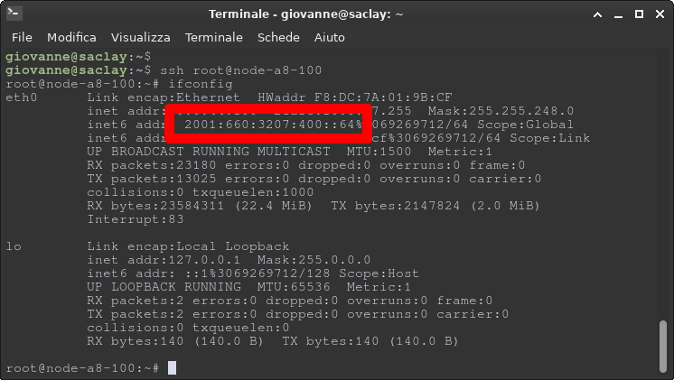

### How to setup for IoT-Lab
In this tutorial you setup multiple greenhouse instances in the IoT-Lab connected via 6LoWPAN/RPL.

### Firmwares
We have to compile the greenhouse firmware and the border router firmware:
- Clone the RIOT repository `git clone https://github.com/RIOT-OS/RIOT`
- Clone the greenhouse repository `git clone https://github.com/kernel-machine/RIOT-GreenHouse`
- Make sure that the Makefile of the greenhouse project has the correct path of the RIOT directory
- Build the gnrc border router firmware
    - Navigate on the border router directory inside RIOT examples `cd RIOT/examples/gnrc_border_router`
    - Make the project in the current location `make ETHOS_BAUDRATE=500000 DEFAULT_CHANNEL=17 BOARD=iotlab-m3`. 
      You can change the value of default channel (17) but must be the same that you will use also for the greenhouse project
    - The file `bin/iotlab-m3/gnrc_border_router.elf` is generated, we use this file later.
- Build the greenhouse firmware
    - Go into the greenhouse directory
    - Make the project using the same channel used for border router compile
      `make ETHOS_BAUDRATE=500000 DEFAULT_CHANNEL=17`.
    - The file `bin/iotlab-m3/greenhouse.elf` is generated.

### Iot-Lab experiment
In IotLab run a new experiment with these nodes on the same deployment location:
- 1 IoT-Lab a8
- 1 Iot-Lab m3 flashed with the firmware `gnrc_border_router.elf` compiled before
- 2 or more Iot-Lab m3 flashed with the firmware `greenhouse.elf`compiled before

### Set up the nodes
When the experiment is submitted and launched, you have to execute these steps:
- Connect via SSH to the deployment location, for example Saclay `ssh YourUsername@saclay.iot-lab.info`
- Configure MQTT
    - Navigate inside the A8 directory `cd A8`
    - Use your favorite CLI text editor to create 5 files:
        - 3 of them are the files provided by AWS to connect the to IoT core
            - rootCA file
            - PEM encoded client certificate
            - PEM encoded client private key
        - The [bridge.conf](https://github.com/kernel-machine/RIOT-GreenHouse/blob/main/resources/mqtt_files/bridge.conf)
          file, in which you have to change the aws endpoint with your endpoint and the paths of the 
          files created in the previous step.
        - The [config.cong](https://github.com/kernel-machine/RIOT-GreenHouse/blob/main/resources/mqtt_files/config.conf)
          file, in which you have to insert the ip6 global address of your a8 node.
          - To get the ip6 address:
            - Connect to the A8 node `ssh root@node-a8-X`
            - enter `ifconfig` to get the ip6 address
            
- Now we can run the MQTT and MQTTS brokers
  - Connect via SSH to the a8 node `ssh root@node-a8-X`
  - Run Mosquitto `mosquitto -c bridge.conf` the configuration file is the one created previously.
  - Open another ssh connection to the a8 node
  - Run RSMB `broker_mqtts config.conf`
- Keeping these connections open you have to set up the border router:
  - Open another connection to Saclay `ssh YourUsername@saclay.iot-lab.info`
  - Enter this command `sudo ethos_uhcpd.py m3-7 tap0 2001:660:3207:04c1::1/64` You have to replace `m3-7` with the node 
    in which you have flashed the firmware `gnrc_border_router.elf`
- For each node that runs the firmware `greenhouse.elf`
    - Connect with nc `nc m3-x 20000`
    - Enter `connect <ip6-of-the-a8-node> <node-id>`
        - The first parameter is the ip of the a8 node running the MQTT broker.
        - The second one is the identifier of the greenhouse instance, must be unique for each node.
    - Now you can check the incoming values on the [application dashboard](https://kernel-machine.github.io/RIOT-GreenHouse/)