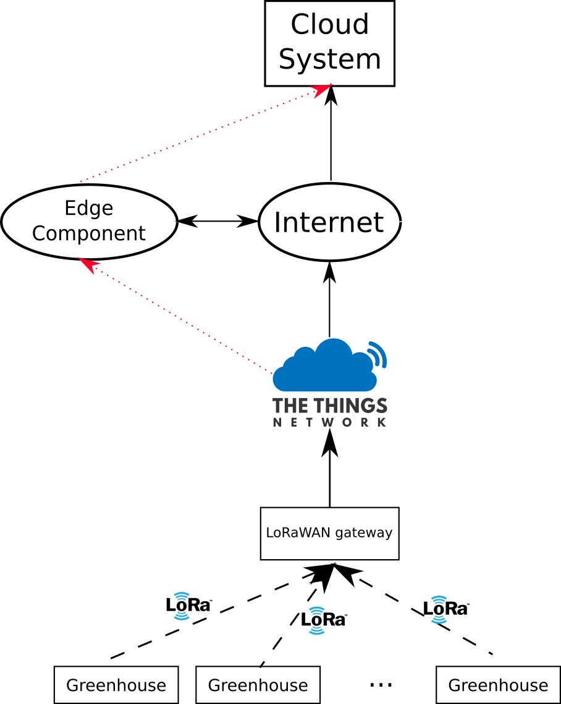
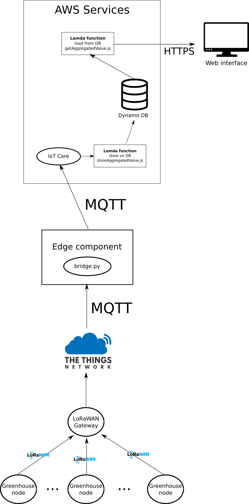

## **LoRaWAN features**

### Current consumption

LoRaWAN is designed to be energy efficient, this feature makes LoRa suitable for battery powered devices.

### Security

LoRaWAN encrypts the payload of the messages using AES-128, when a node is connecting to the network it exchanges the keys to encrypt the messages exchanged between the node and the application server of The Things Network is encrypted.

### Throughput

The throughput is up to 5 kbps in Europe and 27 kbps in the USA, it depends on the bandwidth allowed by the legislation. In the USA the bandwidth is 500 kHZ while in EU is only 125 kHz.
Having this throughput if the payload is too large the end-to-end delay increase, so we have to choose a right compromise between payload size and delay.
For example the delay of the packet sent by LoRaWAN by this application is about 120 ms. That it's fine for this kind of application, but could be an issue for real time devices.

## Edge analysis

In this project the edge data analysis is performed between AWS and The Things Network, this strategy allow us to get some advantages:

- **Decrease the usages of the AWS services**, if we have a network of hundreds devices, applying edge computing it reduces a lot the computation on the AWS service, for example the number of calls of the lambda function, so it could be a good strategy to decrease the cost of the cloud services.
- **Security** delivering aggregated data on the network, the data of the users are keep inside the local network, so are not directly exposed to malicious attack.

## Technical details

### Network diagram

The red arrows are **logical link**, while the black arrows are physical link. 

The devices are connected to the LoRaWAN gateway via LoRa.
The LoRaWAN gateway is part of The Things Network. 

- **IoT devices** use LoRa to sent data
- **LoRaWAN Gateway** is the one of The Things Network installed on the FIT IoT LAB.
- **Edge component** is a component that get data from The Things Network, process them and send the result to the cloud software.
- **Cloud system** is the infrastructure provided by the cloud, in our case the AWS infrastructure.

### Software components architecture

- **Greenhouse nodes**
  The ipv6 and the network stack from the previous assignment have been removed and replaced with the LoRaWAN packages.
  The exchanged messages are bytes.

  An observation is that the flash size of the firmware with LoRaWAN has a smaller size than the one with 6LoWPAN from the previous assignment.

  |      | 6LoWPAN  | LoRaWAN |
  | ---- | -------- | ------- |
  | text | 103264 B | 55172 B |
  | bss  | 28180 B  | 9620 B  |

  The text size (the size in the flash memory) is about 47% smaller and also the memory took by the uninitialized variables (bss) is smaller. So LoRaWAN could be usable also in devices with smaller flash size and RAM than the 6LoWPAN.

- **LoRaWAN gateway** is the LoRaWAN gateway installed on the IoT-LAB that forward the messages to The Things Network 

- **Edge component** it can be executed on any node of the internet. The software executed is the [python program](../../src/EdgeSoftware/bridge.py) that is subscribed to The Things Network MQTT broker to get incoming data from the devices, it aggregates data and send the aggregated result to the AWS IoT core over MQTT.

  The aggregated values are minimum, maximum and average of temperature, air humidity and soil moisture.

  To connect to the MQTT brokers it uses [Paho](https://pypi.org/project/paho-mqtt/)

  The edge is subscribed to the topic `+/devices/+/up` of The Things Network MQTT broker and publishes the aggregated data to the topic `gh_aggr` of AWS IoT Core MQTT broker.

-  **AWS Services**

  - The messages incoming in the **IoT core** are forwarded to the **lambda function** [storeAggregatedValue.js](../../src/AWS/lambda%20functions/storeAggregatedValue.js) that stores the message on DynamoDB.
  - In **DynamoDB** is present only one row that are overwritten for each new message
  - When the **web interface** make an HTTPS request, the lambda function [getAggregatedValue.js](../../src/AWS/lambda%20functions/getAggregatedValue.js) retrieves the current data from DynamoDB.